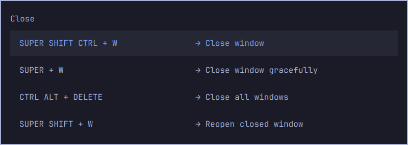

# Grace Window (jam.grace-window)



An Omarchy shell plugin that hides the focused window to **workspace 10**
with a one-minute reopen grace period:

- **SUPER + W** — silently move the selected window to workspace 10 and start
  the 60s grace timer. Focus stays where it was.
- **SUPER + SHIFT + W** — "reopen" the most recently hidden window: bring it
  back to the current workspace, focus it, and cancel its auto-close.
- **Grace expiry** — if a hidden window is never reopened, it is closed for
  real when the timer runs out.
- **SUPER + SHIFT + CTRL + W** — also closes the window for real, immediately.

The feature is a *service* plugin: the state lives in the long-lived
`omarchy-shell` process, and the keybindings drive it over Quickshell IPC
(`omarchy-shell grace-window hide` / `reopen`), so there is no standalone
background script.

## Files

| File | Purpose |
|------|---------|
| `manifest.json` | Omarchy plugin manifest (schema v1, kind `service`) |
| `Service.qml` | The service: IPC handlers, hyprctl dispatch queue, grace sweep |
| `hypr/bindings.lua` | Changes and adds the bindings for this plugin |
| `install.sh` | Installs + enables the plugin and wires the bindings |
| `uninstall.sh` | Reverts everything |

## Install

```bash
./install.sh
```

What it does:

1. Copies the plugin to `~/.config/omarchy/plugins/jam.grace-window/`.
2. `omarchy-shell shell rescanPlugins` then enables it via
   `omarchy plugin enable` (writes `~/.config/omarchy/shell.json`).
3. Appends the binding block to `~/.config/hypr/bindings.lua` and reloads Hyprland.

Safe to re-run; it skips the binding block when already present.

## Uninstall

```bash
./uninstall.sh
```

Restores SUPER+W → *Close window* and SUPER+SHIFT+W → *Omawrite*, and removes
the plugin.

## Usage without the keybindings

Talk to the service directly from Hyprland bindings (or a terminal):

```bash
omarchy-shell grace-window hide       # hide focused window, start grace
omarchy-shell grace-window reopen     # bring the newest hidden window back
omarchy-shell grace-window status     # idle / pending Ns
omarchy-shell grace-window cancel     # forget pendings without closing
```

## Configuration

The grace period is hard-coded to 60 seconds in `Service.qml` (`graceMs`).
Edit it there, or change the keybindings in `hypr/bindings.lua`.

## Notes

- Multiple windows can be hidden in sequence; each one keeps its own grace
  timer, and `reopen` restores the most recent.
- Auto-close uses Hyprland's Lua dispatcher syntax
  (`hl.dsp.window.close({ window = "address:..." })`), which needs Hyprland
  >= 0.55 (Omarchy 4.x ships 0.56).
- Validated with `omarchy plugin validate`.
